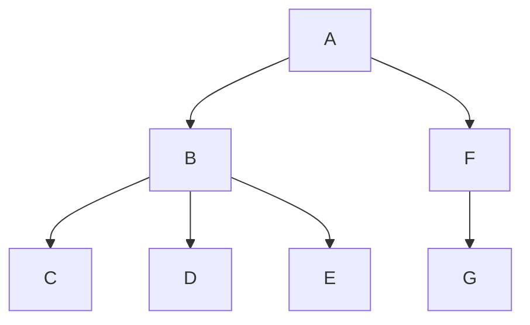

**Uni**versal **S**yntax **T**ree.

> https://github.com/syntax-tree/unist

---

**unist**是语法树的规范。
它在 JavaScript 中有一个很大的[实用程序生态系统][list-of-utilities]，用于处理这些树。
它由其他几个规范实现。

此文档可能不会发布。
有关已发布的文档，请参见[releases][]。
最新发布的版本是[`3.0.0`][release]。

## 简介

本文档定义了语法树的通用格式。
unist 于 2015 年 7 月开始开发。
这个规范是用类似[Web IDL][webidl]的语法编写的。

### 语法树

语法树是源代码甚至是自然语言的表示。
这些树是使分析、转换和生成代码成为可能的抽象。

语法树[有两种风格][abstract-vs-concrete-trees]:

- **具体语法树**: 表示每个细节的结构（例如不区分空白的语言中的空白）
- **抽象语法树**: 只表示与代码语法结构相关的细节的结构（例如忽略在支持双引号还是单引号的语言中使用，如 JavaScript）。

该规范既可以表示抽象语法树，也可以表示具体语法树。

### 本规范适用的地方

unist 并不是为了自给自足。
相反，期望其他规范实现 unist，并将其扩展为表示特定于语言的节点。
例如，请参见以下项目 **[hast][]** (用于 HTML), **[nlcst][]** (用于自然语言), **[mdast][]** (用于 Markdown), 和 **[xast][]** (用于 XML).

unist 与[JSON][]的关系在于，兼容的语法树可以完全用 JSON 表示。
然而，unist 并不局限于 JSON，可以用其他数据格式表示，例如 [XML][].

unist 与[JavaScript][]的关系在于，它有一个丰富的[实用程序生态系统][list-of-utilities]，用于处理 JavaScript 中的兼容语法树。
五个最常用的实用程序加起来每月下载 3000 万次。
然而，unist 并不局限于 JavaScript，也可以在其他编程语言中使用。

unist 与[unified][]、[remark][]、[rehype][]和[retext][]项目有关，因为 unist 语法树在其整个生态系统中使用。

unist 与[vfile][]项目有关，因为它接受消息存储的 unist 节点，并且 vfile 可以是语法树的源 _[file][term-file]_。

## Type

如果您使用的是 TypeScript，您可以通过与 npm 一起安装来使用 unist 类型：

```sh
npm install @types/unist
```

## 节点

unist 语法树中的语法单元称为节点，并实现 **[Node][dfn-Node]** 接口。

### `Node`

```idl
interface Node {
  type: string
  data: Data?
  position: Position?
}
```

`type`字段是表示节点变体的非空字符串。
此字段可用于确定节点实现的 _[type][term-type]_。

`data`字段表示来自生态系统的信息。
`data`字段的值实现了 **[Data][dfn-data]** 接口。

`position`字段表示节点在源文档中的位置。
`position`字段的值实现了 **[Position][dfn-position]** 接口。
如果节点为 _[generated][term-generated]_，则不得存在`position`字段。

鼓励实现 unist 的规范定义更多的字段。
生态系统可以在 **[Data][dfn-Data]** 上定义字段。

unist 中的任何值**都必须**可以用 JSON 值表示: `string`, `number`,`object`, `array`, `true`, `false`, 或 `null`.
这意味着语法树应该能够转换为 JSON 和从 JSON 转换而来，并生成相同的树。
例如，在 JavaScript 中，一个树可以通过`JSON.parse(JSON.stringify(tree))`传递，并产生相同的树。

#### `Position`

```idl
interface Position {
  start: Point
  end: Point
}
```

**Position** 表示节点在源 _[file][term-file]_ 中的位置。

**Position** 的`start`字段表示解析的源区域的第一个字符的位置。
**Position** 的`end`字段表示解析的源区域之后的第一个字符的位置，无论它是否存在。
`start`和`end`字段的值实现 **[Point][dfn-point]** 接口。

如果在解析时，源 _[file][term-file]_ 中不存在由节点表示的句法单元，则称该节点为 _[generated][term-generated]_，并且它一定不具有位置信息。

例如，如果以下值表示为 unist：

```markdown
alpha
bravo
```

…第一个字（`alpha`）将从行`1`、列`1`，偏移量`0`开始，并在行`1`、列`6`，偏移值`5`结束。
换行将从行`1`、列`6`、偏移量`5`开始，并在行`2`、列`1`、偏移量`6`结束。
最后一个单词（`bravo`）将从行`2`、列`1`、偏移量`6`开始，并在行`2`、列`6`、偏移值`11`结束。

#### `Point`

```idl
interface Point {
  line: number >= 1
  column: number >= 1
  offset: number >= 0?
}
```

**Point**表示源 _[文件][term-file]_ 中的一个位置。

`line`字段（1-indexed 整数）表示源文件中的一行。
`column`字段（1-indexed 索引整数）表示源文件中的列。
`offset`字段（0-indexed 整数）表示源文件中的一个字符。

术语`character`表示在[Web IDL][webidl]规范中定义的（UTF-16）代码单元。

#### `Data`

```idl
interface Data { }
```

**Data**表示生态系统与节点相关联的信息。

保证此空间永远不会由 unist 或实现 unist 的规范指定。

### `Parent`

```idl
interface Parent <: Node {
  children: [Node]
}
```

包含其他节点（据说是*[children][term-child]*）的节点扩展了抽象接口**Parent**（**[Node][dfn-node]**）。

`children`字段是表示节点的子级的列表。

### `Literal`

```idl
interface Literal <: Node {
  value: any
}
```

包含值的节点扩展了抽象接口**Literal**(**[Node][dfn-node]**).

`value`字段可以包含任何值。

## 术语汇编

###### Tree

**tree**是一个节点及其所有 _[descendants][term-descendant]_ （如果有的话）。

###### Child

如果 Y 的`children`包括 X，则节点 X 是节点 Y 的**child**。

###### Parent

如果 Y 是 X 的 _[child][term-child]_，则节点 X 是节点 Y 的**parent**。

###### Index

**[child][term-child]** 的 _index_ 是它前面的 _[siblings][term-sibling]_ 个数，如果没有，则为`0`。

###### Sibling

如果 X 和 Y 具有相同的 _[parent][term-parent]_（如果有的话），则节点 X 是节点 Y 的**sibling**。

_[child][term-child]_ 的**前一个 sibling**是其 _[index][term-index]_ 减 1 的 **sibling**。

_[child][term-child]_ 的**下一个 sibling**是其 _[index][term-index]_ 加 1 处的 **sibling**。

###### Root

如果没有 _[parent][term-parent]_，则节点的**root**就是它自己，或者它的 _[parent][term-parent]_ 的**root**。

一个 _[tree][term-tree]_ 的**root**是该 _[tree][term-tree]_ 中没有 _[parent][term-parent]_ 的任何节点。

###### Descendant 后代

如果 X 是 Y 的 _[child][term-child]_，或者如果 X 是节点 Z 的 _[child][term-child]_，则节点 X 是节点 Y 的**descendant**。

**包含的子体**是节点或其**子体**之一。

###### Ancestor

如果 Y 是 X 的 _[descendant][term-descendant]_，则节点 X 是节点 Y 的**祖先**。

**包含的祖先**是一个节点或其**祖先**之一。

###### Head

一个节点的**head**是它的第一个 _[child][term-child]_（如果有的话）。

###### Tail

一个节点的**tail**是它的最后一个 _[child][term-child]_（如果有的话）。

###### Leaf

一个**leaf**是一个没有 _[children][term-child]_ 的节点。

###### Branch

**branch**是具有一个或多个 _[children][term-child]_ 的节点。

###### Generated

如果一个节点没有 _[位置信息][term-positional-info]_ ，则**generated**。

###### Type

节点的**type**是其`type`字段的值。

###### Positional information

节点的**位置信息**是其`position`字段的值。

###### File

**file**是一个源文档，表示为生成语法树而解析的原始文件。
_[位置信息][term-positional-info]_ 表示节点在此文件中的位置。
文件由主机环境提供，而不是由 unist 定义的。

例如，请参见诸如 **[vfile][]** 之类的项目。

###### Preorder

在**preorder** (**NLR**)是[depth-first][traversal-depth] [tree traversal][traversal]，对每个节点执行以下步骤 _N_：

1.  **N**: 访问 _N_ 本身
2.  **L**: 遍历 _[head][term-head]_（然后它的 _next sibling_，递归地向前移动直到到达 _tail_）
3.  **R**: 遍历 _[tail][term-tail]_

###### Postorder

在**postorder** (**LRN**)是[depth-first][traversal-depth] [tree traversal][traversal]，对每个节点执行以下步骤 _N_：

1.  **L**: 遍历 _[head][term-head]_ (那么它 _next sibling_, 递归向前移动直到到达 _tail_)
2.  **R**: 遍历 _[tail][term-tail]_
3.  **N**: 访问 _N_ 本身

###### Enter

当 **[traversing][traversal]** 是一棵树时，**Enter** 是在给定节点 _N_ 上执行其他步骤之前的一个步骤。

例如，当执行 _preorder_ 遍历时，**enter** 是在访问 _N_ 本身之前执行的第一步。

###### Exit

当 **[traversing][traversal]** 树时，**Exit**是在给定节点 _N_ 上执行其他步骤之后的一个步骤。

例如，当执行 _preorder_ 遍历时，**exit** 是在遍历 _N_ 的 _[tail][term-tail]_ 之后执行的最后一步。

## 树遍历

当使用 _[tree][term-tree]_ 进行搜索时，**遍历树**是一项常见任务。
树遍历通常是 _breadth-first_ 或 _depth-first_。

在以下示例中，我们将使用此树:



###### 广度优先遍历

**广度优先遍历** 是在遍历 _[children][term-child]_ 之前，访问一个节点及其所有 _[siblings][term-sibling]_ 以扩大该级别的搜索范围。

对于图中定义的语法树，广度优先遍历首先搜索树的根(**A**)，然后搜索其子级（**B**和**F**），再搜索其子代（**C**、**D**、**E**和**G**）。

###### 深度优先遍历

或者，更常见的是，使用**深度优先遍历**。
首先通过遍历 _[children][term-child]_ 来加深搜索, 在遍历 _[siblings][term-sibling]_ 之前。

对于图中定义的语法树，深度优先遍历首先搜索树的根(**A**)，然后搜索它的一个子（**B** 或 **F**），再搜索它们的子（**C**、**D**和**E**或**G**）。

对于具有 _[children][term-child]_ 的给定节点 _N_，**深度优先遍历** 执行三个步骤，简化为只有二叉树（每个节点都有 _[head][term-head]_ 和 _[tail][term-tail]_，但没有其他子节点）：

- **N**: 访问 _N_ 本身
- **L**: 遍历 _[head][term-head]_
- **R**: 遍历 _[tail][term-tail]_

这些步骤可以按任何顺序进行，但对于非二进制树，**L** 和 **R**同时发生。
如果 **L** 在 **R** 之前完成，则遍历称为 _left-to-right_ 遍历，否则称为 _right-to-left_ 遍历。
在非二叉树的情况下，_head_ 和 _tail_ 之间的其他子级也按该顺序处理，因此对于 _left-to-right_ 遍历，首先遍历 _head_（**L**），然后遍历其 _next sibling_ 等，直到最后遍历 _tail_（**R**）。

因为对于非二叉树，**L** 和 **R** 同时出现，所以我们可以生成四种类型的阶：NLR、NRL、LRN、RLN。

NLR 和 LRN（两个 _left-to-right_ 遍历选项）最常用，分别命名为 _[preorder][term-preorder]_ 和 _[postorder][term-postorder]_。

对于图中定义的语法树，_preorder_ 和 _postorder_ 遍历首先搜索树的根（**A**），然后搜索它的头（**B**），再从左到右搜索它的子树（**C**，**D**，然后**E**）。
在遍历**B**的所有 _[descendants][term-descendant]_ 之后，遍历其下一个同级（**F**），最后遍历其唯一的子（**G**）。

## 实用程序

**实用程序**是使用节点的函数。

有几个项目处理实现 unist 的规范中的节点：

- [hast 实用程序](https://github.com/syntax-tree/hast#list-of-utilities)
- [mdast 实用程序](https://github.com/syntax-tree/mdast#list-of-utilities)
- [nlcst 实用程序](https://github.com/syntax-tree/nlcst#list-of-utilities)
- [xast 实用程序](https://github.com/syntax-tree/xast#list-of-utilities)

### 公用设施清单

- [`unist-util-ancestor`](https://github.com/gorango/unist-util-ancestor)
  — 获取一个或多个节点的共同祖先
- [`unist-util-assert`](https://github.com/syntax-tree/unist-util-assert)
  — 断言节点
- [`unist-util-filter`](https://github.com/syntax-tree/unist-util-filter)
  — 使用传递给定函数的所有节点创建一个新树
- [`unist-util-find`](https://github.com/blahah/unist-util-find)
  — 按条件查找节点
- [`unist-util-find-after`](https://github.com/syntax-tree/unist-util-find-after)
  — 在另一个节点之后查找一个节点
- [`unist-util-find-all-after`](https://github.com/syntax-tree/unist-util-find-all-after)
  — 在另一个节点或索引之后查找节点
- [`unist-util-find-all-before`](https://github.com/syntax-tree/unist-util-find-all-before)
  — 在另一个节点或索引之前查找节点
- [`unist-util-find-all-between`](https://github.com/mrzmmr/unist-util-find-all-between)
  — 查找两个节点或位置之间的节点
- [`unist-util-find-before`](https://github.com/syntax-tree/unist-util-find-before)
  — 在另一个节点之前查找一个节点
- [`unist-util-flat-filter`](https://github.com/unicorn-utterances/unist-util-flat-filter)
  — 平面图版本的`unist-util-filter`
- [`unist-util-flatmap`](https://gitlab.com/staltz/unist-util-flatmap)
  — 通过将一个节点扩展为多个节点来创建新的树
- [`unist-util-generated`](https://github.com/syntax-tree/unist-util-generated)
  — 检查是否生成了节点
- [`unist-util-index`](https://github.com/syntax-tree/unist-util-index)
  — 按属性或计算键索引节点
- [`unist-util-inspect`](https://github.com/syntax-tree/unist-util-inspect)
  — 节点检查器
- [`unist-util-is`](https://github.com/syntax-tree/unist-util-is)
  — 检查节点是否通过测试
- [`unist-util-map`](https://github.com/syntax-tree/unist-util-map)
  — 通过映射节点创建新树
- [`unist-util-modify-children`](https://github.com/syntax-tree/unist-util-modify-children)
  — 修改父级的直系子级
- [`unist-util-parents`](https://github.com/syntax-tree/unist-util-parents)
  — `parent`节点上的引用
- [`unist-util-position`](https://github.com/syntax-tree/unist-util-position)
  — 获取节点的位置信息
- [`unist-util-reduce`](https://github.com/GenerousLabs/unist-util-reduce)
  — 递归地减少树
- [`unist-util-remove`](https://github.com/syntax-tree/unist-util-remove)
  — 从树中删除节点
- [`unist-util-remove-position`](https://github.com/syntax-tree/unist-util-remove-position)
  — 从树中删除位置信息
- [`unist-util-replace-all-between`](https://github.com/unicorn-utterances/unist-util-replace-all-between)
  — 替换两个节点或位置之间的节点
- [`unist-util-select`](https://github.com/syntax-tree/unist-util-select)
  — 使用类似 CSS 的选择器选择节点
- [`unist-util-size`](https://github.com/syntax-tree/unist-util-size)
  — 计算树中的节点数
- [`unist-util-source`](https://github.com/syntax-tree/unist-util-source)
  — 获取文件中值（节点或位置）的来源
- [`unist-util-stringify-position`](https://github.com/syntax-tree/unist-util-stringify-position)
  — 字符串化节点、位置或点
- [`unist-util-visit`](https://github.com/syntax-tree/unist-util-visit)
  — 递归遍历节点
- [`unist-util-visit-parents`](https://github.com/syntax-tree/unist-util-visit-parents)
  — 使用一堆父节点递归遍历节点
- [`unist-util-visit-children`](https://github.com/syntax-tree/unist-util-visit-children)
  — 探望父母的直系子女
- [`unist-util-visit-all-after`](https://github.com/mrzmmr/unist-util-visit-all-after)
  — 在另一个节点之后访问节点
- [`unist-builder`](https://github.com/syntax-tree/unist-builder)
  — 用于创建树的辅助对象

## 工具书类

- **JavaScript**:
  [ECMAScript 语言规范][javascript].
  Ecma 国际.
- **JSON**:
  [JavaScript 对象表示法（JSON）数据交换格式][json],
  T. Bray.
  IETF.
- **XML**:
  [可扩展标记语言][xml],
  T. Bray, J. Paoli, C. Sperberg-McQueen, E. Maler, F. Yergeau.
  W3C.
- **Web IDL**:
  [Web IDL][webidl],
  C. McCormack.
  W3C.

## 贡献

有关入门方法，请参阅[`syntax-tree/.github`][health]中的[`contributing.md`][contributing]。
有关获得帮助的方法，请参阅[`support.md`][support]。

令人敬畏的语法树、unist、hast、xast、mdast 和 nlcst 资源的精心策划的列表可以在[令人敬畏的句法树][awesome]中找到。

这个项目有[行为准则][coc].
通过与此存储库、组织或社区交互，您同意遵守其条款。

## 鸣谢

这个项目的最初版本是由作者 **[@wooorm](https://github.com/wooorm)** 编写的.

特别感谢 **[@eush77](https://github.com/eush77)** 感谢他们的工作、想法和极其宝贵的反馈！
感谢 **[@anandthakker](https://github.com/anandthakker)**,
**[@anko](https://github.com/anko)**,
**[@arobase-che](https://github.com/arobase-che)**,
**[@azu](https://github.com/azu)**,
**[@BarryThePenguin](https://github.com/BarryThePenguin)**,
**[@ben-eb](https://github.com/ben-eb)**,
**[@blahah](https://github.com/blahah)**,
**[@blakeembrey](https://github.com/blakeembrey)**,
**[@brainkim](https://github.com/brainkim)**,
**[@ChristianMurphy](https://github.com/ChristianMurphy)**,
**[@davidtheclark](https://github.com/davidtheclark)**,
**[@denysdovhan](https://github.com/denysdovhan)**,
**[@derhuerst](https://github.com/derhuerst)**,
**[@dozoisch](https://github.com/dozoisch)**,
**[@fazouane-marouane](https://github.com/fazouane-marouane)**,
**[@gibson042](https://github.com/gibson042)**,
**[@hrajchert](https://github.com/hrajchert)**,
**[@ikatyang](https://github.com/ikatyang)**,
**[@inklesspen](https://github.com/inklesspen)**,
**[@izumin5210](https://github.com/izumin5210)**,
**[@jasonLaster](https://github.com/jasonLaster)**,
**[@JDvorak](https://github.com/JDvorak)**,
**[@jlevy](https://github.com/jlevy)**,
**[@justjake](https://github.com/justjake)**,
**[@kmck](https://github.com/kmck)**,
**[@kt3k](https://github.com/kt3k)**,
**[@KyleAMathews](https://github.com/KyleAMathews)**,
**[@luca3m](https://github.com/luca3m)**,
**[@mattdesl](https://github.com/mattdesl)**,
**[@muraken720](https://github.com/muraken720)**,
**[@mrzmmr](https://github.com/mrzmmr)**,
**[@nwtn](https://github.com/nwtn)**,
**[@rhysd](https://github.com/rhysd)**,
**[@Rokt33r](https://github.com/Rokt33r)**,
**[@Sarah-Seo](https://github.com/Sarah-Seo)**,
**[@sethvincent](https://github.com/sethvincent)**,
**[@shawnbot](https://github.com/shawnbot)**,
**[@simov](https://github.com/simov)**,
**[@staltz](https://github.com/staltz)**,
**[@TitanSnow](https://github.com/TitanSnow)**,
**[@tmcw](https://github.com/tmcw)**,
和
**[@vhf](https://github.com/vhf)**,
为 unist 及相关项目做出贡献！

## 许可证

[CC-BY-4.0][license] © [Titus Wormer][author]

[health]: https://github.com/syntax-tree/.github
[contributing]: https://github.com/syntax-tree/.github/blob/main/contributing.md
[support]: https://github.com/syntax-tree/.github/blob/main/support.md
[coc]: https://github.com/syntax-tree/.github/blob/main/code-of-conduct.md
[awesome]: https://github.com/syntax-tree/awesome-syntax-tree
[logo]: https://raw.githubusercontent.com/syntax-tree/unist/367da2e/logo.svg?sanitize=true
[releases]: https://github.com/syntax-tree/unist/releases
[license]: https://creativecommons.org/licenses/by/4.0/
[author]: https://wooorm.com
[release]: https://github.com/syntax-tree/unist/releases/tag/3.0.0
[abstract-vs-concrete-trees]: https://eli.thegreenplace.net/2009/02/16/abstract-vs-concrete-syntax-trees/
[dfn-node]: #node
[dfn-position]: #position
[dfn-point]: #point
[dfn-data]: #data
[term-tree]: #tree
[term-preorder]: #preorder
[term-postorder]: #postorder
[term-child]: #child
[term-parent]: #parent-1
[term-index]: #index
[term-sibling]: #sibling
[term-descendant]: #descendant
[term-head]: #head
[term-tail]: #tail
[term-generated]: #generated
[term-type]: #type
[term-positional-info]: #positional-information
[term-file]: #file
[traversal]: #tree-traversal
[traversal-depth]: #depth-first-traversal
[list-of-utilities]: #list-of-utilities
[webidl]: https://webidl.spec.whatwg.org
[json]: https://datatracker.ietf.org/doc/html/rfc7159
[xml]: https://www.w3.org/TR/xml/
[javascript]: https://262.ecma-international.org/9.0/
[hast]: https://github.com/syntax-tree/hast
[xast]: https://github.com/syntax-tree/xast
[nlcst]: https://github.com/syntax-tree/nlcst
[mdast]: https://github.com/syntax-tree/mdast
[unified]: https://github.com/unifiedjs/unified
[remark]: https://github.com/remarkjs/remark
[rehype]: https://github.com/rehypejs/rehype
[retext]: https://github.com/retextjs/retext
[vfile]: https://github.com/vfile/vfile
